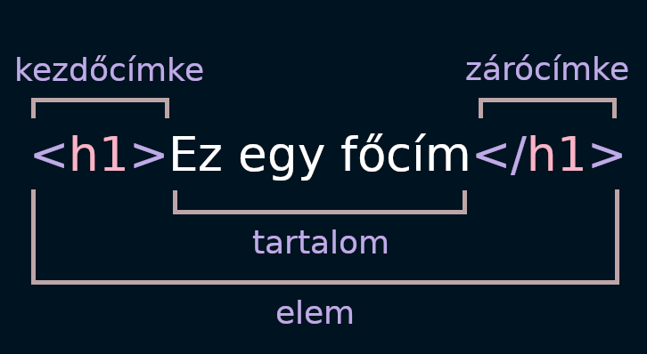

A HTML (angolul: HyperText Markup Language = hiperszöveges jelölőnyelv) egy nyelv (Nem programozási nyelv, csak leírónyelv), melyet weboldalak készítéséhez fejlesztettek ki, és mára már internetes szabvánnyá vált a W3C (World Wide Web Consortium) támogatásával.
Vegyünk egy példát:

```html
Helló világ!
```

Ha azt szeretnénk, hogy ez a szöveg egy külön egység legyen, bekezdéssé alakíthatjuk ha azt egy bekezdés (&lt;p>) tag-be illesztjük.

```html
<p>
  Helló világ!
</p>
```

<p class="blog-note"><b>Megjegyés:</b> A tag-ek HTML-ben NEM! case-sensitive-ek. Tehát akár csupa nagy vagy kis betűvel is írhatjuk őket! Páldául egy &lt;title> tag írható &lt;title>, &lt;TITLE> vagy akár &lt;TiTlE> ként is, mindegyik változat működni fog! De általános konvenció, hogy a html tag-eket csupa kis betűvel írjuk!</p>

<div class="section-divider-dots"></div>

## HTML elemek felépítése



Egy HTML elem fő részei:

1. **Kezdőcímke:** Az elem nevét tartalmazza (ebben az esetben `h1`) zárójelekkel közrefogva. Azt jelzi, hogy az elem hol lép hatályba.
2. **Zárócímke:** Ez ugyanaz mint a kezdőcímke azzal a különbséggel, hogy az elem neve előtt `/` jelet tartalmaz. Az elem végét jelöli. Kezdőknél gyakori hiba, hogy lefelejtik a zárócímkét, ami nem várt hibákat eredményezhet.
3. **Tartalom:** Az elem tartalma. Mi esetünkben az `Ez egy főcím` szöveg.
4. **Elem:** A kezdőcímke, zárócímke és a tartalom hármasát hívjuk egy elemnek.

### Egymásba ágyazás

a Html lehetővé teszi, hogy egy elem egy (vagy több) másik elemet tartalmazzon - ezt egymásba ágyazásnak nevezzük.

```html
<p>Ez egy <strong>kiemelt szöveg</strong>!</p>
```

### Block és inline elemek

### Üres elemek

## HTML attribútumok


## HTML dokumentum felépítése


## Kommentezés

