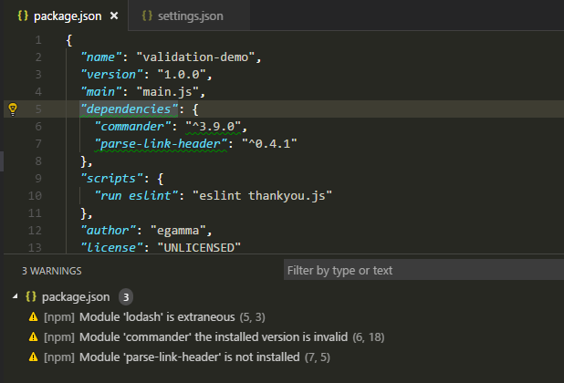

## Tartalom
* [Bevezetés](#bevezetes)
* [Telepítés](#telepites)
* [Ajánlott bővítmények JavaScript / React fejlesztéshez kategóriák szerint](#bovitmenyek)
* [Gyorsbillentyűk](#gyorsbillentyuk)
* [Hasznos linkek](#hasznos_linkek)

<a name='bevezetes'> </a>

<div class="section-divider-dots"></div>

## Bevezetés

Valószínűleg már rendelkezel egy alapértelmezett szövegszerkesztővel a számítógépeden. De webes fejlesztéshez többre lehet szükséged, mint egy Notepad vagy TextEdit. 

Célszerű használni a Visual Studio Code-ot, ami egy ingyenesen letölthető szövegszerkesztő alkalmazás gazdag funckiónalitással (JavaScript IntelliSense, debuggolás, kód navigálás, refaktorálás és még sok egyébb nyelvi feature-t támogat).

A legtöbb szolgáltatás automatikusan működik telepítést követően, míg más csomagokhoz kezdeti konfigurálás elvégzése szükséges a legjobb felhasználói élmény eléréséhez.

<a name='telepites'> </a>

<div class="section-divider-dots"></div>

## Telepítés

Ajánlott rendszerkövetelmény:
```
- 1.6 GHz vagy gyorsabb processzor
- 1 GB RAM
```

Telepítéshez kövesd az alábbi platformspecifikus útmutatókat:

### Windows

1. Töltsd le a [Visual Studio Code telepítőt](https://go.microsoft.com/fwlink/?LinkID=534107) Windows-ra.
2. Miután letöltődött, futtasd a telepítőt (VSCodeUserSetup-{version}.exe). Ez csak pár percet vesz igénybe.
3. Alapértelmezettként a VS Code a következő mappa alá települ:
```C:\users\{username}\AppData\Local\Programs\Microsoft VS Code```

<p class="blog-note"><b>Megjegyés:</b> .NET Framework 4.5.2 vagy magasabb verzió szükséges a VS Code telepítéshez!</p>

<p class="blog-note"><b>Tipp:</b> A telepítés hozzáadja a Visual Studio Code-ot a %PATH%-hoz, ezután terminálból bármelyik mappában állva a 'code .' parancsal tudod megnyitni a VS Code-ot, így a mappa fájljait elkezdheted szerkeszteni!</p>

### macOS

1. Töltsd le a [Visual Studio Code telepítőt](https://go.microsoft.com/fwlink/?LinkID=534106) macOS-re.
2. Tartalom kibontásához kattints duplán a letöltött archívumra.
3. Húzd a ```Visual Studio Code.app```-ot az ```Alkalmazások``` mappába, így elérhető lesz az alkalmazás ```Launchpad```-on.
4. Rögzítheted a VS Code-ot a Dockodban ha az alkalmazásikonon jobb klikket nyomsz, és a ```Beállítások - Megtartás a Dockban``` menüpontot választod.

#### Parancssorból való futtatáshoz:

* Indítsd el a VS Code-ot
* Nyísd meg a keresőt (⇧⌘P), gépeld be a 'shell command' szöveget és nyomj a ```Shell Command: Install 'code' command in PATH``` lehetőségre.


* Indítsd újra a terminált, hogy a beállítás érvényesülni tudjon, ezután terminálból bármelyik mappában állva a 'code .' parancsal tudod megnyitni a VS Code-ot, így a mappa fájljait elkezdheted szerkeszteni!

### Linux

#### Debian és Ubuntu alapú disztribúciók

A legegyszerűbb módja feltelepíteni a Visual Studio Code-ot egy Debian/Ubuntu alapú disztribúcióra ha letöltöd és telepíted a [.deb csomag (64-bit)](https://go.microsoft.com/fwlink/?LinkID=760868) -ot grafikusan (Ubuntu Software Center), vagy terminálból a következő parancsot kiadva: 

```bash
sudo apt install ./<file>.deb

# If you're on an older Linux distribution, you will need to run this instead:
# sudo dpkg -i <file>.deb
# sudo apt-get install -f # Install dependencies
```

A .deb csomag telepítése automatikusan telepíti az apt repot és az aláírt kulcsot ami automatikus frissítést tesz lehetővé a rendszer csomagkezelője által.

<a name='bovitmenyek'> </a>

<div class="section-divider-dots"></div>

## Ajánlott bővítmények JavaScript / React fejlesztéshez kategóriák szerint


### Snippetek

A kód snippetek segítséget nyújtanak az ismétlődő kód gyorsabb írásához, ezzel rövidítve a fejlesztési időt. Mikor telepíted a VS Code-ot, az már tartalmazni fog beépített snippeteket, de ha ez nem lenne elég könnyedén megírhatod a sajátodat, vagy egyszerűen behúzhatsz egy harmadik fél által kialakított bővítményt.

Pár bővítmény amit érdemes lehet minden JavaScript / React fejlesztőnek telepíteni:

* [JavaScript (ES6) code snippets](https://marketplace.visualstudio.com/items?itemName=xabikos.JavaScriptSnippets): Legnépszerűbb csomag több mint 1.6 millió telepítéssel. Javascript nyelvi elemek ES6-os szintaktikával, Javascript és TypeScript támogatással is.

* [ES7 React/Redux/GraphQL/React-Native snippets](https://marketplace.visualstudio.com/items?itemName=dsznajder.es7-react-js-snippets): React, Redux, Graphql és React-Native könyvtárakhoz írt kódrészletek. (Javascript és TypeScript támogatással)

### Linter

Sokkal könnyebb megérteni egy nagy kódbázist, ha a benne található kód következetes. Akár a szóköz és tab közötti váltakozás, vagy a sor végi pontosvesszőre gondolunk, fontos, hogy mindenki egységes stílusban fejlessze a forráskódot egy adott projekten belül.

Ugyanakkor meglehetősen gyakori, hogy a programozók elfelejtik melyik kódolási konvenciót kell használniuk. A szabályok helyes alkalmazása érdekében szabványokat kell érvényesíteni. Annak biztosítása érdekében, hogy a kódod megfeleljen a szabványnak, szükséged lesz egy linterre. Ezek a Visual Studio Code legnépszerűbb linterbővítményei:

* [ESLint](https://marketplace.visualstudio.com/items?itemName=dbaeumer.vscode-eslint): Integrált [ESLint](https://eslint.org) VS Code-hoz. A bővítmény a megnyitott projekt könyvtárában feltelepített ESLint könyvtárat használja. Ha a mappa nem rendelkezik, a bővítmény globálisan telepített verziót keres.

Új mappákban szükség lehet egy ```.eslintrc``` konfigurációs fájl létrehozására is, amiben létrehozhatod a saját szabályrendszeredet.

* [JSHint](https://marketplace.visualstudio.com/items?itemName=dbaeumer.jshint): TODO

* [StandardJS - JavaScript Standard Style](https://marketplace.visualstudio.com/items?itemName=chenxsan.vscode-standardjs): TODO

* [JSLint](https://marketplace.visualstudio.com/items?itemName=ajhyndman.jslint): TODO

### Node

Minden JavaScript projekt legalább egy node csomagot tartalmaz, kívéve ha valaki szeret nehéz dolgokat csinálni. 🙂 Íme néhány VS Code bővítmény, amely segít a csomagokkal való könnyebb munkában:

* [npm](https://marketplace.visualstudio.com/items?itemName=eg2.vscode-npm-script): A ``` package.json``` használatával validálja a felhasznált csomagokat. Biztosítja, hogy a feltelepített csomagok megfelelő verziószámmal rendelkeznek. Kiemeli azokat a csomagokat amik nincsenek telepítve de a ```package.json``` már tartalmaz és a nem települt modulokra is figyelmeztetést ad a fejlesztőnek.



* [npm Intellisense](https://marketplace.visualstudio.com/items?itemName=christian-kohler.npm-intellisense): Kiegészíti az npm modulok nevét az [import](https://developer.mozilla.org/en-US/docs/Web/JavaScript/Reference/Statements/import) parancsokban.


* [Path IntelliSense](): TODO

* [Node exec](): TODO

* [View Node Package](): TODO

* [Node Readme](): TODO

* [Search node_modules](): TODO

* [Import Cost](): TODO


### Formázás

Néha írunk olyan kódrészletet, amely nincs egy sorban a többi sorral. Ezek mellett biztosnak kell lennünk, hogy a zárojelek és tag-ek megfelelő formátumba legyenek megformázva. Ez a folyamat hosszas lehet a fejlesztő számára, miközben nem ad hozzá új értéket a termékhez.

Szerencsére vannak bővítmények amik ezt a feladatot elvégzik helyettünk: 

* [Beautify](https://marketplace.visualstudio.com/items?itemName=HookyQR.beautify): TODO

* [Prettier - Code formatter](https://marketplace.visualstudio.com/items?itemName=esbenp.prettier-vscode): TODO

### Böngésző támogatás

* [Debugger for Chrome](https://marketplace.visualstudio.com/items?itemName=msjsdiag.debugger-for-chrome): TODO

* [Live Server](https://marketplace.visualstudio.com/items?itemName=ritwickdey.LiveServer): TODO

* [REST Client](https://marketplace.visualstudio.com/items?itemName=humao.rest-client): TODO

### Tesztelés

* [Mocha sidebar](https://marketplace.visualstudio.com/items?itemName=maty.vscode-mocha-sidebar): TODO

* [ES6 Mocha Snippets](https://marketplace.visualstudio.com/items?itemName=spoonscen.es6-mocha-snippets): TODO

* [Node TDD](https://marketplace.visualstudio.com/items?itemName=prashaantt.node-tdd): TODO

### Egyéb

* [Paste JSON as Code](https://marketplace.visualstudio.com/items?itemName=quicktype.quicktype): TODO

* [CodeMetrics](https://marketplace.visualstudio.com/items?itemName=kisstkondoros.vscode-codemetrics): TODO


### Bővítmények telepítése parancssorból

```bash
code --install-extension TODO
```

<a name='gyorsbillentyuk'> </a>

<div class="section-divider-dots"></div>

## Gyorsbillentyűk

```java
// Search files.
CTRL + p

// Commands.
CTRL + Shift + p

// Select duplicate values.
CTRL + d

// Move line up or down.
ALT + Up or Down

// Duplicate line.
ALT + SHIFT + Down

// Select everything between brackets.
ALT + SHIFT + Right
```

<a name='hasznos_linkek'> </a>

<div class="section-divider-dots"></div>

## Hasznos linkek

* [Setting up Visual Studio Code - https://code.visualstudio.com/docs/setup/setup-overview](https://code.visualstudio.com/docs/setup/setup-overview)
* [JavaScript in Visual Studio Code - https://code.visualstudio.com/docs/languages/javascript](https://code.visualstudio.com/docs/languages/javascript)
* [Working with JavaScript - https://code.visualstudio.com/docs/nodejs/working-with-javascript](https://code.visualstudio.com/docs/nodejs/working-with-javascript)